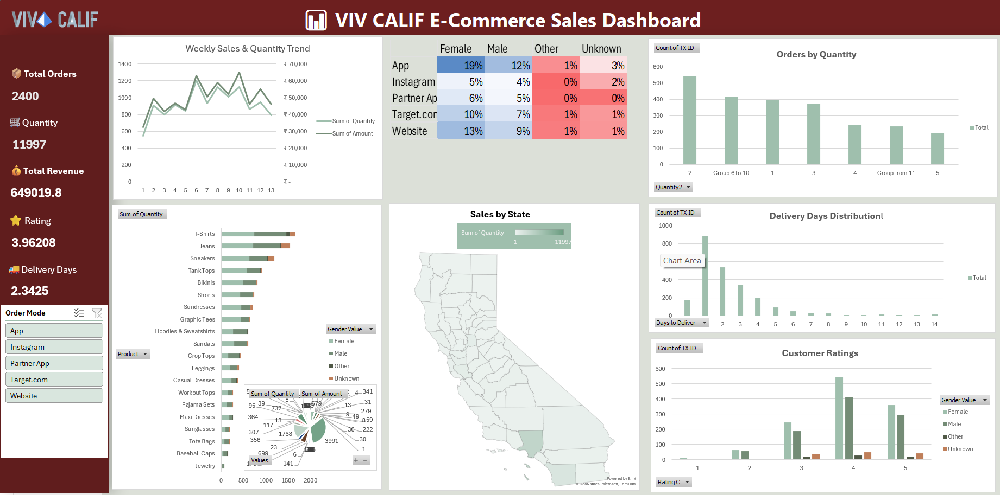

# 📊 VIVO CALIF E-Commerce Sales Dashboard

An interactive **Microsoft Excel Dashboard** built to analyze e-commerce sales performance, customer behavior, product trends, delivery performance, and sales channels. This dashboard converts raw sales data into actionable business insights through interactive visualizations and KPIs.

---

## 📌 Project Overview

This project demonstrates how Microsoft Excel can be used as a Business Intelligence tool to create an interactive dashboard. Using Pivot Tables, Pivot Charts, Slicers, and Map Charts, the dashboard provides a clear overview of sales performance and supports data-driven decision-making.

---

## 🎯 Objectives

- Analyze overall sales performance.
- Monitor weekly sales and quantity trends.
- Identify top-selling products.
- Analyze customer purchasing behavior.
- Compare sales across different order channels.
- Evaluate delivery performance.
- Visualize state-wise sales distribution.
- Build an interactive dashboard for business reporting.

---

## 🛠️ Tools & Technologies

- Microsoft Excel
- Pivot Tables
- Pivot Charts
- Slicers
- Conditional Formatting
- Excel Map Chart
- Data Cleaning
- Dashboard Design

---

## 📈 Dashboard KPIs

- 📦 **Total Orders:** 2,400
- 🛒 **Total Quantity Sold:** 11,997
- 💰 **Total Revenue:** ₹649,020
- ⭐ **Average Customer Rating:** 3.96
- 🚚 **Average Delivery Time:** 2.34 Days

---

## 📊 Dashboard Visualizations

- Weekly Sales & Quantity Trend
- Sales by Order Channel & Gender
- Orders by Quantity
- Top Selling Products
- Sales by State (Map)
- Delivery Days Distribution
- Customer Ratings Analysis
- Interactive Order Channel Filter

---

## 💡 Key Insights

- Processed **2,400 customer orders** with a total revenue of **₹649,020**.
- Sold **11,997 units** across multiple product categories.
- **T-Shirts** emerged as one of the top-selling products.
- The **Website** and **App** channels contributed significantly to total sales.
- Most customer ratings were **4 and 5**, indicating high customer satisfaction.
- Average delivery time was **2.34 days**, reflecting efficient order fulfillment.
- Female customers contributed a larger share of purchases compared to other customer groups.

---

## 📷 Dashboard Preview



---

## 📂 Repository Structure

```
VIVO-CALIF-Ecommerce-Dashboard/
│
├── Store_Ecommerce.xlsx
├── dashboard.png
└── README.md
```

---

## 🚀 Skills Demonstrated

- Data Cleaning
- Data Analysis
- Data Visualization
- Dashboard Development
- KPI Reporting
- Business Intelligence
- Microsoft Excel
- Analytical Thinking

---

## 📌 Conclusion

This project demonstrates the ability to transform raw business data into meaningful insights using Microsoft Excel. It showcases practical skills in dashboard development, data visualization, KPI reporting, and business analysis, making it suitable for data analytics portfolio projects.

---

## 👨‍💻 Author

Cheranjeevi M
Data Analyst

---
### 📫 Connect with Me

- 💼 LinkedIn: www.linkedin.com/in/cheranjeevi-m
- 💻 GitHub: 

⭐ If you found this project helpful, consider giving it a star.
